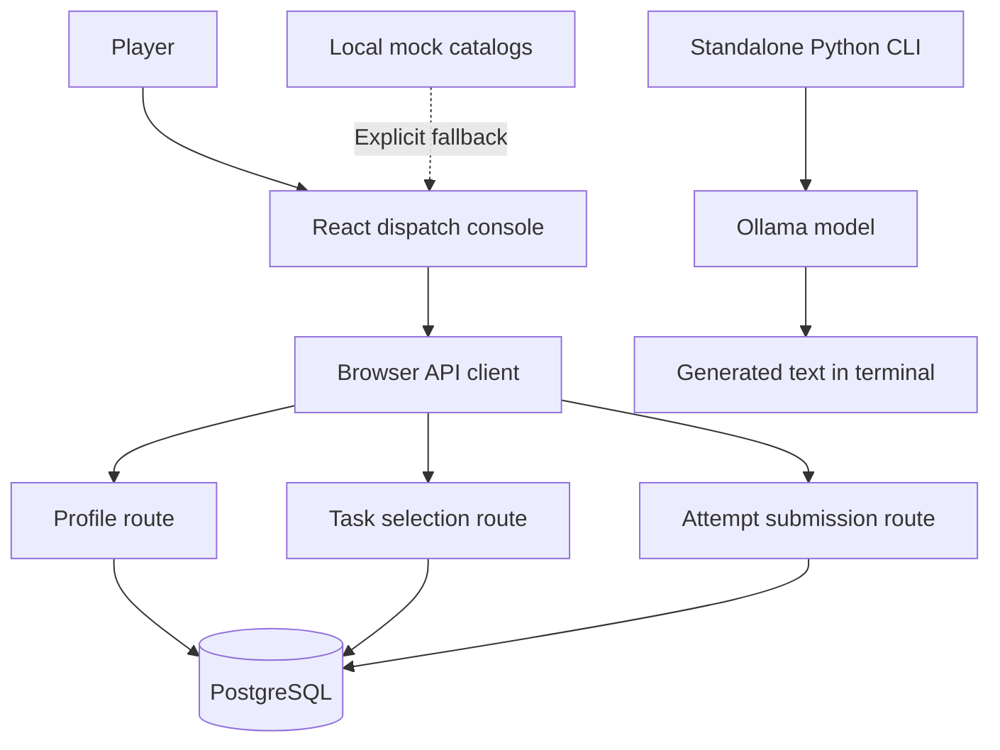
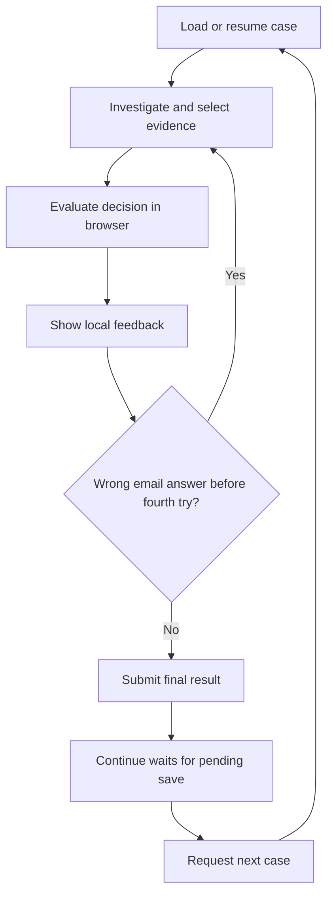

# SENTRI Architecture

Last reviewed: 2026-09-08.

This document describes the source currently in this repository. Proposed changes are explicitly identified; they are not implemented capabilities. The review was static and did not verify a running database or deployment.

## 1. Product and implementation scope

SENTRI (also named Sentricol in the code) is a cybersecurity training game presented as an employee dispatch console. Players investigate scenarios, submit decisions, receive feedback, and build graduation progress and skill profiles.

The current application is a Next.js application with a React client interface, Next.js API routes, and PostgreSQL persistence. A separate Python/Ollama command-line prototype generates training content but is not integrated with the application's request flow.

Email investigation is the focus of the mock/demo flow. Password assessment and data classification have UI and scoring paths, and the database selector can return all three incident types when eligible content exists.

## 2. Runtime structure



| Area | Implementation | Responsibility |
|---|---|---|
| Application framework | Next.js 16, React 19, TypeScript | Page rendering and HTTP endpoints |
| Presentation | Tailwind CSS 4, reusable React components | Console, investigation panels, feedback, settings |
| Browser orchestration | `app/page.tsx` | Active task, retries, local assessment, transitions, save coordination |
| API client | `lib/sentricolApi.ts` | Profile, next-task, and decision requests |
| Server persistence | `lib/db.ts`, `pg` | Database pool, queries, transactions |
| Data model | `database/schema.sql` | Content, users, assignments, results, learning profiles |
| Demo setup | `scripts/seed.mjs`, `database/demo-*.json` | Populate demo records |
| Generation prototype | `py/sentri.py`, `py/SentriModel/` | Prompt-driven local generation |

Database access is server-only. `DATABASE_URL` is required by the API routes; they return 503 when it is absent. The browser uses `NEXT_PUBLIC_DEMO_USER_CODE`, defaulting to `usr_0001`. Mock task fallback is enabled only when `NEXT_PUBLIC_ALLOW_MOCK_FALLBACK` equals `true`; it does not provide full offline persistence or a replacement profile API.

## 3. Interface and state ownership

`app/layout.tsx` provides the game container, scaling through `ScaleManager`, global styling, and production analytics. The page renders a fixed 1920-pixel design with 1080- or 1200-pixel height, scaled to the viewport.

`app/page.tsx` owns most game orchestration:

- Active task and dispatch queue, selected task IDs, daily counters, graduation progress.
- Investigation checkbox state and selected categories.
- Email retry count and local investigation-performance estimates.
- Decision and feedback modals, task transitions, settings, and sound hooks.
- Profile loading, task fetching, and pending decision-save coordination.

Components render the console header, company information, task and progress panels, email investigation, password and classification views, handbook, desk controls, and feedback. Some components own local presentation state; they are not all stateless.

The queue currently operates as one active case at a time. The page loads a case on mount and requests the next case after completion. There is no active timed incident-generation loop. The day starts at a hardcoded value of 7, while the header time uses the current calendar date. End Day resets local counters and presentation state; it does not persist or close a database game session, and the next-task endpoint can return the same unfinished assignment.

## 4. API and task lifecycle

| Endpoint | Input | Behavior |
|---|---|---|
| `GET /api/profile` | `userCode` query parameter | Returns player identity details, experience, graduation percentage, and unlocked difficulty |
| `POST /api/tasks/next` | `userCode` | Resumes an unfinished assignment or selects and creates one with an attempt |
| `POST /api/attempts` | Attempt ID, decision, optional categories, retry number, verification flag | Evaluates and completes an attempt, updates assignment and learning records |

### Assignment selection

The next-task route performs its work in a transaction and locks the user row to serialize assignment creation for that user. It first looks for an assigned or started task with an unfinished attempt and resumes it, allowing recovery after a browser refresh.

When creating an assignment, it filters for active tasks, approved cases, an active employee, eligible difficulty, and matching department/rank restrictions. It excludes cases already assigned or started for the player.

Candidate priority is a weighted weakness score:

```text
sum((100 - ability_score) × tag_intensity × scoring_weight)
----------------------------------------------------------------
              sum(tag_intensity × scoring_weight)
```

Missing skill ability defaults to 50, and cases without effective tag weights default to a match score of 50. Highest weakness wins, with random tie-breaking. Completed cases are not excluded or subject to a cooldown, so immediate repetition is possible. The route returns the raw scenario payload and assignment/attempt metadata.

### Browser decision flow



Email answers are checked against the scenario's classification and, when present, an exact set of required suspicious categories. Wrong email answers before the fourth try remain local. Only a correct answer or the fourth wrong answer is submitted. Password and classification decisions are submitted immediately.

The page updates graduation progress optimistically, then replaces it with the server's returned percentage. Failed saves show an error. Fetching the next case waits for the pending save; a rejected save prevents advancement. Retry recovery and replay of a successfully saved response are not fully modeled.

### Server scoring and persistence

The attempt route locks an unfinished attempt, checks the decision and required email categories, and completes the assignment in one transaction. It writes the result, reported actions, per-tag outcomes, skill profiles, progress, and aggregate statistics.

| Outcome | Graduation change |
|---|---:|
| Correct email answer, first reported try | +5 |
| Correct email answer, second reported try | +2 |
| Correct email answer, third or fourth reported try | 0 |
| Wrong email answer, fourth reported try | -1 |
| Other wrong answer | 0 |
| Correct password or classification answer | +5 |

Progress is clamped to 0–100. Correct answers receive the task's base experience and score 100; incorrect answers receive zero experience and score 0. Each case tag receives an ability adjustment of positive or negative 2 multiplied by its intensity, clamped within an ability range of 0–100.

The server accepts the retry number supplied by the browser, constrained to 1–4. It does not reconstruct prior retries. The stored attempt number begins at 1 and is not updated to that reported number. Time limits are stored but not enforced by this route. Unlocked difficulty is read by selection but is not advanced by the result handler.

## 5. Data architecture

The schema uses relational entities for identity, eligibility, lifecycle, and metrics, with JSONB for varying scenario content.

| Domain | Main tables | Current integration |
|---|---|---|
| Organization and identity | companies, departments, ranks, employees, users | Profile and assignment eligibility; no authentication enforcement in reviewed routes |
| Content catalog | incident_types, tasks, cases, tags, case_tags | Selection and scoring |
| Supporting content | company_policies, handbook_chapters, indicators, case_indicators, case_contact_options | Schema foundations; the reviewed gameplay routes do not serve these tables |
| Training records | task_assignments, task_attempts, attempt_actions, task_results, attempt_tag_results | Written by assignment and result routes |
| Learning state | user_progress, user_skill_profiles, user_statistics | Profile display, adaptive selection, result updates |
| Extended learning | game_sessions, milestone_tests, milestone_test_cases, achievements, user_achievements | Schema foundations without corresponding workflows in the reviewed API |
| AI processing | ai_generation_jobs | Schema foundation; no connected worker in the reviewed implementation |

Tasks define eligibility and training parameters. Cases hold versioned scenario content and answers. Assignments connect a player to a case, and attempts/results record outcomes. Foreign keys, checks, uniqueness constraints, and indexes provide useful integrity boundaries.

Scenario `raw_content` is returned directly to the client. The client types include answer-bearing fields such as `isLegitimate`, `correctDecision`, `correctClassification`, and required evidence. Runtime payload validation and a distinct public scenario contract are missing.

## 6. AI generation status

`py/sentri.py` calls Ollama from an interactive command-line loop. It selects additional Markdown prompts for `generateTask` or `generateEmailTask`, starts a fresh conversation for each request, and prints generated output and timing information.

It does not currently insert cases into PostgreSQL, process `ai_generation_jobs`, validate output against the application's TypeScript shapes, or expose a web endpoint. Prompt field names and application payload fields also differ, so integration needs an explicit content contract or adapter.

The schema supports review states, but cases default to `approved`. A future generation path must explicitly create drafts or pending-review cases rather than relying on that default.

## 7. Architectural gaps

### Assessment authority and identity

Correctness is evaluated in both browser and server. Answers are present in browser payloads, early retries are not persisted, and the server trusts the reported retry count. Refresh resumes the assignment but resets local retry and investigation history.

The profile and task endpoints trust a supplied user code. Attempt submission looks up an attempt ID without checking authenticated ownership. Database roles alone do not provide application authorization.

### Lifecycle and reliability

The page combines rendering, transitions, grading, persistence, and adaptation. Overlapping category/checkbox state and multiple independent feedback flags make valid transitions harder to reason about.

Row locks and transactions protect important writes, but duplicate submission returns an error rather than the previously committed result. A response lost after commit therefore needs explicit recovery. Local day state and database session state are not connected.

### Learning evidence

The same final case outcome adjusts every associated tag. Earlier wrong answers are missing from durable history, which can overstate mastery after retries. Investigation time currently equals total elapsed task time whenever any category is reported; it is not separately measured. Verification is supported by the API, but the page's save function does not pass the verification flag.

Mock adaptation uses local category weaknesses and weighted random selection, while database adaptation uses persisted tag ability and highest-score selection. These are distinct policies and should not be treated as equivalent behavior.

### Persistence operations and validation

The repository has a schema SQL file and demo seed script, but no versioned migration workflow. The pool is cached globally only outside production; production calls can create additional pools. Remote database TLS is configured without certificate verification. Deployment configuration should address pool lifecycle, connection budgets, and trusted certificates.

Request bodies are asserted as TypeScript types with limited runtime checks. Invalid JSON and malformed field types need deliberate API handling.

## 8. Proposed target architecture — not yet implemented

Keep one Next.js application and PostgreSQL, with clear internal module boundaries. A separate generation worker can be introduced when AI content ingestion is needed.

| Module | Owns |
|---|---|
| Identity | Authenticated player, roles, organization access, assignment ownership |
| Content catalog | Versioned scenarios, private answer keys, validation, approval |
| Training engine | Assignment state, individual attempts, retries, hints, scoring, completion |
| Learner model | Skill evidence, progress rules, difficulty advancement, repetition policy |
| Interface | Rendering, user input, temporary presentation state |
| Generation worker | AI drafts, schema validation, quality checks, review submission |

Proposed rules:

1. The server records every decision and determines retry number, feedback, reward, and completion.
2. Public task payloads contain only information available to the player at that stage; answer keys remain server-side.
3. Refresh restores authoritative assignment and retry state. Submission IDs allow safe replay and return previously saved results.
4. UI transitions follow an explicit lifecycle: loading, investigating, submitting, feedback, retry or completed, then next case. Error recovery is part of that lifecycle.
5. Learning metrics distinguish final correctness, first-try correctness, evidence selection, hints, and measured timing.
6. AI content follows generation → validation → review → approval → eligible catalog. Active gameplay selects approved content without waiting for generation.

### Suggested design sequence

1. Define attempt versus assignment semantics, refresh behavior, retry limits, and completion rules.
2. Define authenticated identity and public/private scenario contracts.
3. Specify authoritative grading and recoverable submission behavior.
4. Separate interface state from training and learner-model rules.
5. Define trustworthy skill measurements, difficulty advancement, and case repetition.
6. Connect generation and additional session/milestone features when their product rules are settled.

## 9. Verification scope

`tests/database-routes.test.cjs` contains isolated route tests using a database double. They cover four email scoring scenarios and resuming an existing assignment without inserting another. They do not exercise actual PostgreSQL SQL execution, real locking, authentication, browser retries, or generation integration.

This documentation update was checked against the source files. It does not claim runtime, database, or deployment validation.
